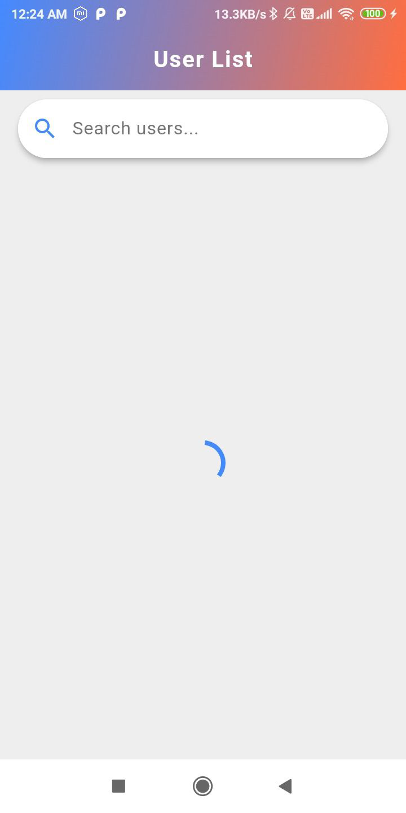
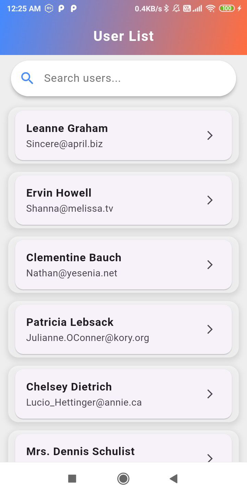
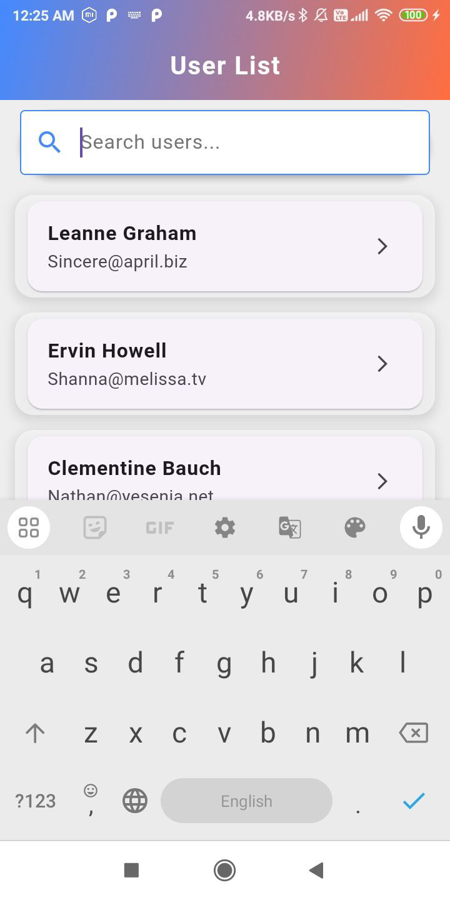
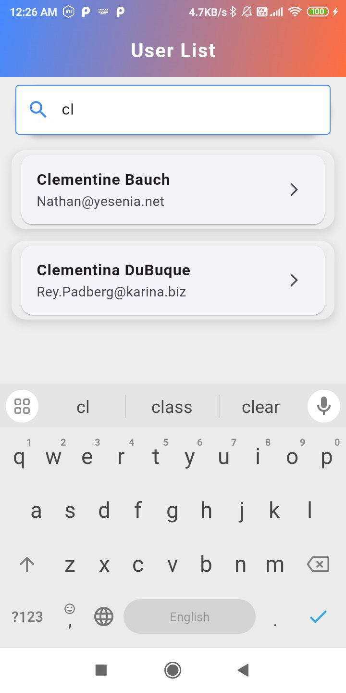
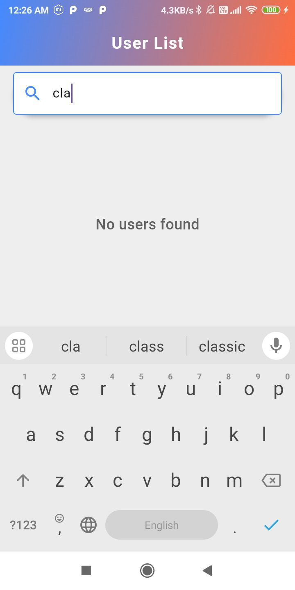
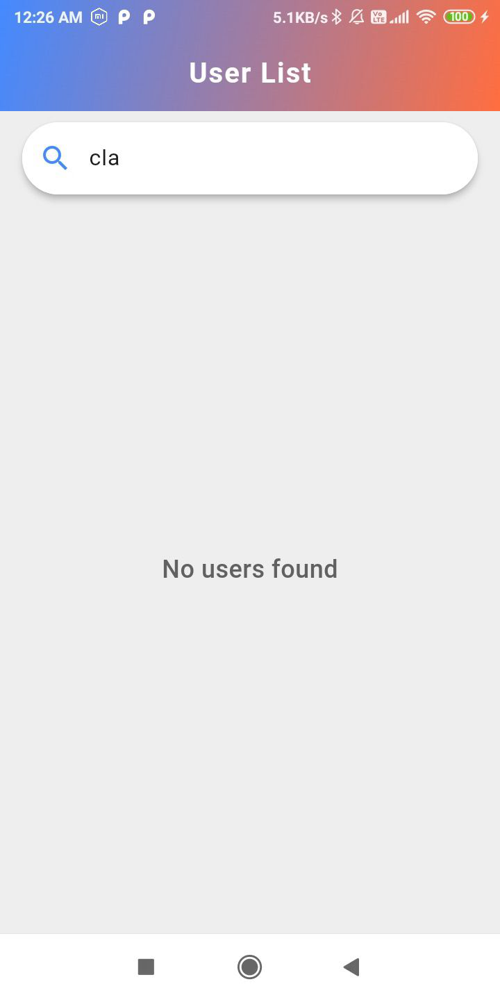
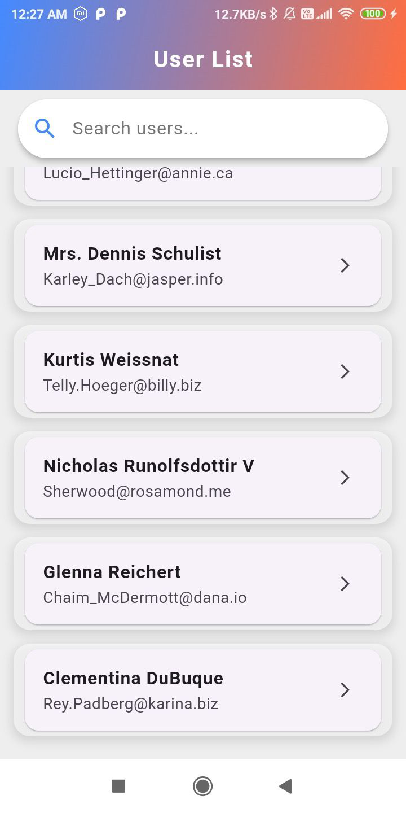
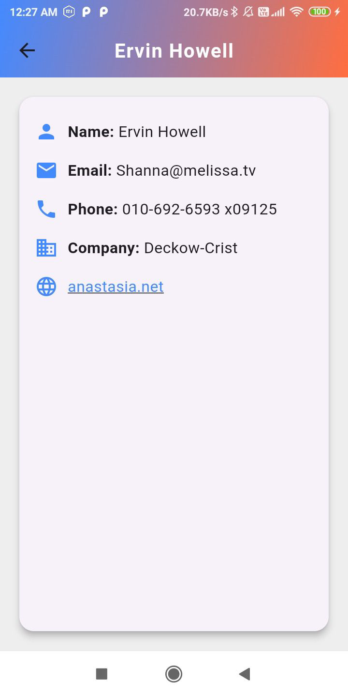
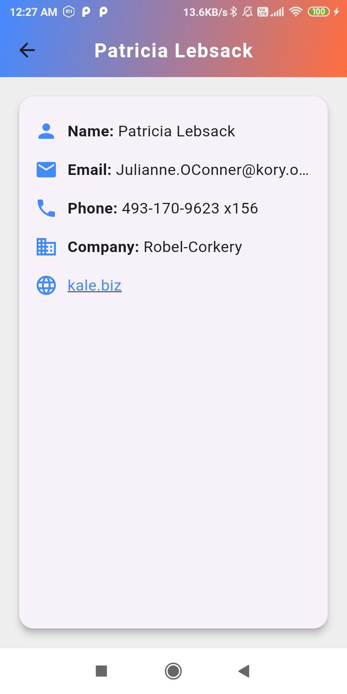

# User list App

A Flutter-based user list application that allows users to view a list of users, search for specific users, and view detailed user information.

## 📌 Features
- Fetch and display a list of users.
- Search functionality to filter users by name or email.
- User detail screen with name, email, phone, company, and website.
- Refresh functionality to reload users.
- Error handling for failed API requests.
- Clean UI with a gradient app bar and modern design elements.

## 🚀 Getting Started

### Prerequisites
- Ensure you have Flutter installed: [Flutter Installation Guide](https://flutter.dev/docs/get-started/install)
- Install dependencies using:

  ```sh
  flutter pub get
  ```

### Running the App
- Connect a device or start an emulator.
- Run the command:
  
  ```sh
  flutter run
  ```

## 📦 Dependencies Used
```yaml
dependencies:
  flutter:
    sdk: flutter
  provider: ^6.1.2
  http: ^1.3.0
  cached_network_image: ^3.4.1
  flutter_spinkit: ^5.2.1
```

## 🔹 Assumptions & Decisions
- The app fetches user data from an API.
- The provider package is used for state management.
- Error handling and refresh functionality are implemented for robustness.
- The app is designed with a clean and simple UI.

## Screenshots

### User List Screen








### User Detail Screen


